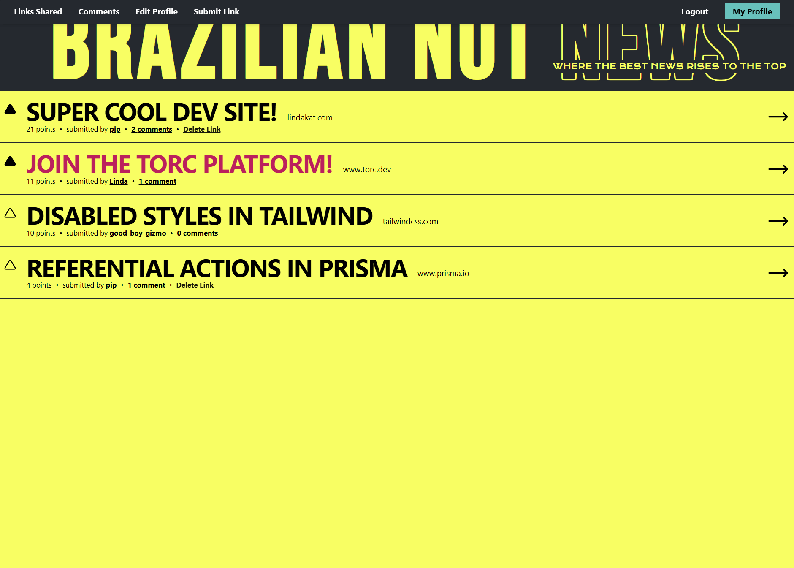

# Brazilian Nut News

A Hacker News clone built with RedwoodJS.

The project idea and design are from [Amy Dutton](https://www.linkedin.com/in/amy-dutton/)'s Freaking Fullstack workshop she hosted on October 31, 2024. This was a three hour workshop where we covered the premise, did our project setup, and started to create our first components to get a feel for how Redwood works.

I loved the design and was enjoying exploring Redwood as a potential tool, so decided to finish building out a v1 for the site!

## Site Preview



## Tech Stack

The main tech used for this site is **[RedwoodJS](https://docs.redwoodjs.com/docs/introduction/)**, a full stack framework for building applications. One of the great things with Redwood is that it handles connecting all of these tools together for you, allowing you to get started quickly.

Under the hood, it uses:

- **[React](https://react.dev/)** - frontend UI components
- **[Typescript](https://www.typescriptlang.org/)** - type safety
- **[Tailwind](https://tailwindcss.com/)** - UI styling
- **[Storybook](https://storybook.js.org/)** - building components in isolation
- **[dbAuth](https://redwoodjs.com/docs/authentication#self-hosted-auth-installation-and-setup)** - Redwood's local authentication solution
- **[Jest](https://jestjs.io/)** - testing library
- **[Prisma](https://www.prisma.io/)** - database ORM
- **[Supabase](https://supabase.com)** - PostgresQL database provider
- **[Yarn](https://yarnpkg.com/)** - build tool
- **[Netlify](https://www.netlify.com/)** - deployment

## Project Structure

As a fullstack framework, your frontend and backend code all live in the same repository. The top level `api` and `web` folders have their own Jest and Typescript configs, as well as a `package.json` file. Those will extend the root level configs.

```txt
/
├── api/                    # Backend top-level folder
│   ├── db/                 # Prisma schema and migrations
│   ├── src/                # Main backend dev folder
│   │   ├── directives/     # Auth and GraphQL directives
│   │   ├── functions/      # Auth and GraphQL handler functions
│   │   ├── graphql/        # SDL files for models
│   │   ├── lib/            # Auth and DB setup
│   │   ├── services/       # CRUD operations for models
│   ├── types/              # GraphQL types, auto-generated
├── assets/                 # Preview images for README
├── scripts/                # DB seed and misc global scripts
├── web/                    # Frontend top-level folder
│   ├── .storybook/         # Storybook config
│   ├── config/             # Tailwind config
│   ├── public/             # Favicon and robots.txt
│   ├── src/                # Main frontend dev folder
│   │   ├── components/     # UI components
│   │   ├── hooks/          # Custom hooks for mutation handling
│   │   ├── layouts/        # Page layouts
│   │   ├── pages/          # Pages used in routing
│   │   ├── App.tsx/        # Entry point for our app
│   │   ├── index.html/     # The root HTML file
│   │   ├── mutations.ts/   # GraphQL mutations collection
│   │   ├── Routes.tsx/     # Routing file
│   │   ├── index.css/      # Tailwind extended classes
│   │   ├── scaffold.css/   # CSS reset
│   ├── types/              # GraphQL types, auto-generated
├── redwood.toml            # Redwood configuration
```

## Features

- Users can sign up, login, and reset their password
- Users can view the home feed of all links shared, and click the link title to visit the link
- Users can click the comment count on a link and see the full discussion about that link
- Authenticated users can submit links to be added to the home feed
- Authenticated users can leave comments on links
- Authenticated users can upvote links and comments (and can click the upvote arrow again to remove an upvote)
- Authenticated users can update their profile information, including a display name and social profile links
- Users can view user profiles to see that users' social links, the age of their account, and the number of upvotes they've given and received
- Users can see all the links a user has shared
- Users can see all the comments a user has left
- Authenticated users can delete the links or comments they have submitted

## Future Improvements

There are some features and abilities that, were I to continue development on this, I'd love to implement. I've split these into features that would improve the user experience, and things that are nice to have from a development perspective.

### User Improvements

- The site needs a home button. Ideally this would be the title of the page since that shows on every page, however I needed to do some unique style constraints to match the design and it wasn't possible to achieve this. It would be great to find a better workaround for this or a different way to provide navigation back to the main feed.
- There's no way for users to delete their account, or to directly change their email or password. Passwords can be reset through the "reset password" page, however having a way for users to modify this directly would be a better experience.
- On a shared link after the title, the user can see the URL's origin. However clicking this has no effect. This style was part of the provided design and on Hacker News, clicking an origin link will show all of the links shared from that website. I'd love to implement this so it works as expected.
- The original design had a way for comments to be replied to in a thread. For a v1 this was more complexity than I wanted to implement. However, it is a better experience for directly responding to someone's comment, so would be nice to implement this.

### Developer Improvements

- In Storybook, the profile layout and many of the page stories rely on the site's API server to be running to work. Ideally these would actually use the mock service worker to mock the data they need instead. I attempted to get this working but with minimal experience here and conflicting results from AI tooling, this wasn't possible to fix yet. Would be very beneficial to get this working.
- I really wanted to figure out how to get my `profileNavigation` story to show the style difference when the link you're on is active, but nothing I tried allowed this to work. I've opened a [discussion on the Redwood forums](https://community.redwoodjs.com/t/how-to-mock-route-in-storybook/7935), but so far no new information has been shared. Would be great to figure this out one day.

## Development Commands

| Command                               | Action                                           |
| :------------------------------------ | :----------------------------------------------- |
| `yarn install`                        | Installs dependencies                            |
| `yarn rw dev`                         | Starts local dev server at `localhost:8910`      |
| `yarn rw storybook`                   | Starts storybook server at `localhost:7910`      |
| `yarn rw test <side>`                 | Starts test suite, can specify `web` or `api`    |
| `yarn redwood generate <type> <name>` | Creates files for components, cells, and more    |
| `yarn redwood g sdl <model> --force --no-tests` | Regenerates just the sdl file, preserving existing tests |
| `yarn rw prisma migrate dev`          | Migrates local schema changes to your remote db  |
| `yarn rw setup auth --help`           | Initial auth scaffolding and setup               |
| `yarn rw deploy netlify`              | Builds and deploys site                          |

Redwood also provides a GraphiQL explorer for your data when the dev server is running, available at `http://localhost:8911/graphql`.

For specifics on these commands and to see the full suite of commands available, you can visit the [CLI reference](https://redwoodjs.com/docs/cli-commands).
